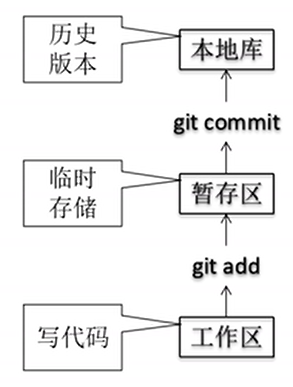
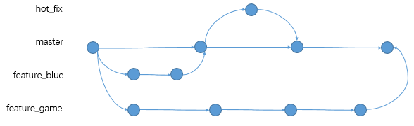
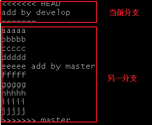
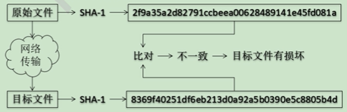

### 1、git/github/gitlab使用教程

> ##### git具有的功能：
>
> - 协同修改
>   - 多人并行地修改服务器端的同一个文件
> - 数据备份
>   - 不仅保存目录和文件的当前状态，还能保存每个提交过的历史状态
> - 版本管理
> - 权限控制
> - 历史记录
> - 分支管理

> ##### git的优势：
>
> - 大部分操作在本地完成，不需要联网
> - 完整性保证（Hash算法）
> - 尽可能添加数据而不是删除或修改数据
> - 分支操作非常快捷流畅（快照）
> - 与Linux命令全面兼容
> - 可以回滚

> ##### git结构：
>
> 工作区 = git add =》  暂存区    = git commit  =》  本地库
>
> ​               写代码   =》              临时存储             =》   历史版本
>
> 

> ##### git和代码托管中心：
>
> 代码托管中心：维护远程库
>
> - 局域网环境下
>   - GitLab服务器
> - 外网环境下
>   - GitHub
>   - 码云

> ##### 本地库和远程库：
>
> 本地库：团队内部协作
>
> 远程库：跨团队协作

### 2、课程大纲

> 课程介绍
>
> 环境配置
>
> 版本追踪
>
> Github详解
>
> 复原变更
>
> 分支合并
>
> 多人协同开发
>
> 服务器自动部署
>
> Gitlab详解

#### 3、环境安装

##### windows安装Git bash

> Git官网：https://git-scm.com/
>
> 测试:
>
> ```sh
># Git Bash
> git --version
> cd Desktop
> mkdir projects
> touch 1.txt
> rm -f 1.txt
> ls
> ```

##### git bash 中的shell常用命令

> ```sh
>pwd
> ls -l
> cd
> mkdir
> touch
> rm
> clear
> ```

##### 配置用户名和邮箱

> ```sh
> git config --global user.name "dragon"           # 设置（或更改）用户名
> git config --global user.email "zyl631@126.com"  # 设置（或更改）邮箱
> git config --list       #　列出git用户的所有信息
> git config user.name    #　查看用户名
> git help
> # usage: git help [--all] [--guides] [--man | --web | --info] [<command>]
> git help config         # 查看config命令的帮助文档
> git help commit
> ```

##### 管理git项目

>> **设置签名**
>
>- 形式
>   - 用户名：
>   - Email地址：
>
>- 作用
>   
>- 区分不同开发人员身份
>   
>- 辨析
>   
>- 这里设置的签名和登录远程库（代码托管中心）的账号、密码没有任何关系
>   
>- 命令
>
> - 项目级别/仓库级别：仅在当前本地库范围内有效
>
>   - `git config user.name tom`
>   - `git config user.email tom@test.com`
>   - 保存在项目.git/config文件中
>
>   ```sh
>   $ cat .git/config
>   [core]
>           repositoryformatversion = 0
>           filemode = false
>           bare = false
>           logallrefupdates = true
>           symlinks = false
>           ignorecase = true
>   [user]
>           name = tom
>           email = tom@test.com
>   ```
>
> - 系统用户级别：登录当前操作系统的用户范围
>
>   - `git config global user.name tom_glb`
>   - `git config global user.email tom_glb@test.com`
>   - 保存在系统家目录~/.gitconfig文件中
>
>   ```sh
>   $ cat ~/.gitconfig
>   [user]
>           name = tom_glb
>           email = tom_glb@test.com
>   ```
>
>   
>
> - 级别优先级
>
>   - 就近原则：项目级别优先
>   - 如果只有系统用户级别的签名，就以系统用户级别的签名为准
>   - 二者都没有不允许
>
>基本操作：
>
>- 初始化本地Git
>  - git init/git init ./git init directory
>  -  .git目录保存的是本地仓和暂存区
>
>- 状态查看
>
>   - `git status`
>   - 查看工作区、暂存区状态
>
>- 添加操作
>
>   - `git add [file name]`
> - 将工作区的 "新建/修改" 添加到暂存区
>
>   - 提交操作
>
>    - git commit -m "commit message" [filename]
>    - 将暂存区的内容提交到本地库
>
>- 查看历史记录
>
>   - git log --pretty=oneline # 完整hash值
>   - git log --oneline              # 缩短hash值
>   - git reflog                          # HEAD@{移动到当前需要几步}     
>
> ```sh
> $ git reflog  # HEAD相当于指针
> 38b6cc2 (HEAD -> master) HEAD@{0}: commit: add n.txt
> df45b49 HEAD@{1}: commit: add m.txt
> 9b5272d HEAD@{2}: commit: add l.txt
> b3ec1c5 HEAD@{3}: commit: add k.txt
> 2533739 HEAD@{4}: commit: add j.txt
> 242b2ab HEAD@{5}: commit: add i.txt
> ad055dd HEAD@{6}: commit: add h.txt
> 3be1728 HEAD@{7}: commit: add g.txt
> 21bc186 HEAD@{8}: commit: add f.txt
> fc10e55 HEAD@{9}: commit: add e.txt
> 780b5cd HEAD@{10}: commit: add d.txt
> dd3d7f7 HEAD@{11}: commit: add c.txt
> 6e906d5 HEAD@{12}: commit: add b.txt
> b3c87ae HEAD@{13}: commit: add a.txt
> 88cd435 HEAD@{14}: commit: My third commit,modify good.txt
> 1c476f9 HEAD@{15}: commit: My second commit,modify good.txt
> e02fb7d HEAD@{16}: commit (initial): My first commit.new file good.txt
> ```
>
>- 前进后退
> - 移动指针HEAD到相应版本
> - 基于索引值操作【推荐】
>   - git reset --hard [局部索引值（hash值）]
> - 使用^符号：只能后退
>   - git reset --hard HEAD^  # 后退一步
>   - git reset --hard HEAD^^^  # 后退三步
>   - 一个^表示后退一步，n个表示后退n步
> - 使用~符号：只能后退
>   - git reset --hard HEAD~n  # n表示后退n步
> - reset命令的三个参数对比
>   - --soft
>     - 仅仅在本地库移动HEAD指针
>   - --mixed
>     - 在本地库移动HEAD指针
>     - 重置暂存区
>   - --hard
>     - 在本地库移动HEAD指针
>     - 重置暂存区
>     - 重置工作区
>- 删除文件并找回
> - 前提：删除前，文件存在时的状态提交到了本地库
> - 操作：git reset --hard [指针位置]
>   - 删除操作已经提交到本地库：指针位置指向历史记录
>   - 删除操作尚未提交到本地库：指针位置使用HEAD
>- 比较文件差异
> - git diff [文件名]
>   - 将工作区中的文件和暂存区进行比较
> - git diff [本地库中历史记录] [文件名]
>   - 将工作区中的文件和本地历史记录比较
> - 不带文件名比较多个文件

> 分支管理
>
> - 什么分支？
>
>   - 在版本控制过程中，使用多条线同事推进多个任务。
>
>   
>
> - 分支的好处
>
>   - 同时并行推进多个功能开发，提交开发效率
>   - 各个分支在开发过程中，如果某一个分支开发失败，不会对其他分支有任何影响，只需将失败的分支删除重新开始即可。
>
> - 分支操作
>
>   ```
>   git status
>   git branch -v 
>   git branch host_fix
>   git branch -v
>   git checkout hot_fix
>   
>   ```
>
>   
>
>   - 创建分支
>
>     - git branch [分支名]
>
>   - 查看分支
>
>     - git branch -v
>
>   - 切换分支
>
>     - git checkout [分支名]
>
>   - 合并分支
>
>     - 第一步：切换到接受修改的分支（被合并，增加新内容）上
>       - git checkout [被合并分支名]
>     - 第二步：执行merge命令
>       - git merge [有新内容的分支名]
>
>   - 解决冲突
>
>     - 冲突的表现
>
>     
>
>     - 冲突的解决
>       - 第一步：编辑文件，删除特殊符号
>       - 第二步：把文件修改到满意的程度，保存退出
>       - 第三步：git add [文件名]
>       - 第四步：git commit -m "日志信息"
>         - 注意：此时commit一定不能带具体文件名
>
>     

> git基本原理
>
> - 哈希
>
>   - 哈希是一个系列的加密算法，各个不同的哈希算法虽然加密强度不同，但有几个共同特点：
>
>     - 不管输入数据量有多大，输入同一哈希算法，得到的加密长度固定
>     - 哈希算法确定，输入数据确定，输出数据能够保证不变
>     - 哈希算法确定，输入数据有变化，输出数据一定有变化，而且通常变化很大
>     - 哈希算法不可逆
>     - 哈希结果值不区分大小写字母
>
>   - git底层采用的是SHA-1算法
>
>   - 哈希算法可以被用来验证文件
>
>   - 原理图如下
>
>     
>
>   - git就是靠这种机制来从根本上保证数据完整性的。
>
> - Git保存版本到机制
>
>   - 集中式版本控制工具的文件管理机制
>     
>     - 以文件变更列表的方式存储信息，这类系统将它们保存的信息看做是一组基本文件和每个文件随时间逐步累积的差异。
>     
>       
>     
>   - Git的文件管理机制
>   
>     - 版本：快照流，组成一个快照流链条
>     - 分支：HEAD指针

> Github 
>
> https://github.com
>
> 注册阿里邮箱，然后注册一个github账号
>
> ```sh
> # 查看本地保存远程库链接
> git remote -v 
> # 保存远程库到本地，别名为origin
> git remote add origin https://github.com/account/projectname.git
> # 推送
> git push origin master
> # 
> git clone https://github.com/account/projectname.git
> ```
>
> - 克隆
>   - 命令
>     - `git clone [远程地址]`
>   - 完整的把远程库下载到本地
>   - 创建origin远程地址别名
>   - 初始化本地库
> - 邀请加入团队成员
>   - 注册另一个邮箱，注册新github账号
>   - Repository name -> Seting -> Manage access -> Invite a collaborator
>   - https://github.com/Dragon631/Demo1/invitations
> - 拉取
>   - pull=fetch+merge
>   - git fetch [远程库地址别名] [远程分支名]
>   - git merge [远程库地址别名/远程分支名]
> - 解决冲突
>   - 要点
>     - 如果不是基于GitHub远程库的最新版，不能推送，必须先拉取(pull)
>     - 拉取下来后如果进入冲突状态，则按照"分支冲突解决"操作解决即可
>   - 

> 本地初始化
>
> ```sh
> # 进入到项目目录
> $ git init
> $ ls -lA .git/
> total 7
> -rw-r--r-- 1 a 197121 130 8月  12 17:21 config
> -rw-r--r-- 1 a 197121  73 8月  12 17:21 description
> -rw-r--r-- 1 a 197121  23 8月  12 17:21 HEAD
> drwxr-xr-x 1 a 197121   0 8月  12 17:21 hooks/
> drwxr-xr-x 1 a 197121   0 8月  12 17:21 info/
> drwxr-xr-x 1 a 197121   0 8月  12 17:21 objects/
> drwxr-xr-x 1 a 197121   0 8月  12 17:21 refs/
> # 注意：不要随便删除或修改.git中的文件和目录。
> ```
>
> 

> 远程初始化
>
> ```sh
> git  add
> ```
>
> 


> ```sh
> git init             # 初始化git项目为当前目录
> git init [name]      # 初始化目录名为[name]的git项目
> git add [filename]   # 添加git追踪的文件
> git add .            # 添加git追踪当前所有文件
> git status           # 查看git项目状态
> git rm --cached [filename]  # 取消对filename文件的追踪
> ```

##### commit

> 使用commit前必须先初始化git项目，而且文件通过add添加追踪，
>
> 否则无法进行commit命令
>
> commit的作用是提交保存，当前项目做的修改是否保存取决于是否做了commit
>
> 每commit提交一次则生成一个档案号
>
> ```
> git commit      # 注：commit前，先git add file    
> git commit -m   # -m 添加描述      
> git commit -am  #　git add 与 git commit -m 的结合    
> ```

log 追踪

> ```sh
> git log
> git log -p -2               #　查看最近两次提交内容的差异
> git log --author
> git log --oneline           # 一行显示
> git log --graph             # 图形化显示
> 
> $ git log --pretty=oneline  # 完整显示hash值
> 0664a9b420e8453605c2da43773a42e9a9c4dae6 (HEAD -> master) add style.css
> 84a0d3526234f4de25b367d94e1e78a4ad5ee091 updata index.html
> 9832f86b2d72ac6419af559748cc19957dbbfb10 add and modify
> a9f20b060a724eee28dc317552866cbede989254 add index.html
> 1ba5c36be2d3da55243ccf52d7bf0c21e0afce63 1
> 
> $ git log --pretty=format
> git log --pretty=format:"%h - %an, $ar : %s"
> 0664a9b - Mr.Dragon,  : add style.css
> 84a0d35 - Mr.Dragon,  : updata index.html
> 9832f86 - Mr.Dragon,  : add and modify
> a9f20b0 - Mr.Dragon,  : add index.html
> 1ba5c36 - Mr.Dragon,  : 1
> ```

##### 追踪文件修改前后的区别

> ```sh
> git diff           # commit 之后，git diff将返回空
> git diff --staged  # add 之后，可以通过git diff --staged 查看区别
> ```

##### 文件的删除、重命名和移动

```sh
git rm [filename]                   # 文件删除
# 删除方法1：
touch test.txt
git add test.txt
git commit -m 'add test.txt'
rm -f test.txt
git add test.txt
git commit -m 'del test.txt'

# 删除方法1：
touch test.txt
git add test.txt
git commit -m 'add test.txt'
git rm test.txt                     # 删除
git commit -m 'del test.txt'
git status

git mv [oldname] [newname]          # 文件重命名
git mv [filename] stuff/pretty.txt  # 文件移动
```

##### 文件忽略

> ```sh
> touch .gitignore          # 创建隐藏文件
> mkdir node_modules        # 创建测试目录
> touch test.txt            # 创建测试文件
> 
> # 将/node_modules和*.txt添加到.gitignore隐藏文件中
> git status                
> 
> vim ./gitignore
> /node_modules                 # 忽略/node_modules文件夹下所有文件
> *.txt                         # 忽略.txt结尾的文件
> *.zip                         # 忽略.zip结尾的文件
> git rm -r --cached filename   # 去掉已经托管的文件，然后提交即可
> ```
>
> 有时候，gitignore考虑不全面，发现有不该提交的文件已经提交后，仅仅在.gitignore中加入忽略是不行的。这个时候需要执行：
>
> `git rm -r --cached filename`

##### 项目演练

```sh
# 查看数据
ls -la
total 57
drwxr-xr-x 1 wyp 197121  0 八月    6 22:14 ./
drwxr-xr-x 1 wyp 197121  0 八月    5 22:32 ../
-rw-r--r-- 1 wyp 197121  0 八月    6 22:11 .DS_Store
drwxr-xr-x 1 wyp 197121  0 八月    6 22:16 .git/
-rw-r--r-- 1 wyp 197121 24 八月    6 22:14 .gitignore
drwxr-xr-x 1 wyp 197121  0 八月    6 22:12 .vscode/
drwxr-xr-x 1 wyp 197121  0 八月    6 22:15 img/
-rw-r--r-- 1 wyp 197121  0 八月    6 22:12 index.html
-rw-r--r-- 1 wyp 197121  0 八月    6 22:12 main.css
-rw-r--r-- 1 wyp 197121  0 八月    6 22:12 main.js

# 查看忽略内容
$ cat .gitignore
*.vscode
*.DS_Store
```

```sh
# 操作过程
git init
.gitignore               # 添加忽略文件或目录
git status
git add .
#  git rm --cached <file>   移除某个已添加的文件
git rm --cached main.js  # 如：main.js
git rm -r --cached .     # 移除当前所有，移到 暂存区，commit 后彻底删除
git add .                # 重新添加
git commit -m 'first commit'

rm -f main.js            # 系统删除，git回到工作区
git add .				 # 提交删除到暂存区
git commit -m '彻底删除'

git log
git log --oneline
echo '<h1>Hello Git.</h1>' > index.html
git ststus
git diff                             # 刚修改完，保存在缓存区，可直接用diff查看区别
git add .
git diff --staged                    # 没有commit之前可以添加--staged查看区别
git commit -m 'indix.html changed'   # 确定无误后，执行commit提交保存
git log --pretty=oneline
git log --oneline
```

##### 一键还原

> ```sh
> git checkout -- [filename] # 恢复到上一次的状态
> # 注意：add 之后checkout将无法进行恢复
> echo 'haha' >> main.js
> git status
> git checkout -- main.js    # 方法1
> # git restore main.js      # 方法2（new）
> git status
> ```

##### 撤销追踪操作与文件还原

> ```sh
> # 旧版
> git reset HEAD [filename]  # 撤销当前文件的检查，add之后的情景
> # HEAD 相当于一个指针，可以指向一个文件或一个版本
> git checkout -- [filenaem]
> # 新版
> git restore --staged <filename>
> git restore <filename>
> 
> # 旧版本
> echo 'haha' >> main.js
> git add main.js
> git status
> git checkout -- main.js   # 恢复失败
> git reset HEAD main.js    # 恢复到add前状态
> git checkout -- main.js   # 成功恢复，或git restore main.js 
> 
> # 新版本
> echo 'haha' >> main.js
> git add main.js
> git status
> git restore main.js             # 恢复失败
> git restore --staged main.js    # 恢复到add前状态
> git restore main.js             # 成功恢复
> git status
> 
> ```

##### 版本回退

> v1-> v2-> v3
>
> 回退v1，会删除v2、v3

> ```sh
> git reset --hard HEAD^   # 回退到上一个版本
> git reset --hard HEAD^^  # 回退到上上个版本
> git reset --hard HEAD [hash号]  # 回退到指定hash的版本
> git reflog   # 指针指向日志
> ```

##### 回到旧版本

> v1-> v2-> v3
>
> 回到v1: v1-> v2-> v3-> v4
>
> 新生成v4，v4=v1，保留v2、v3

> ```sh
> git log                           # 查看日志，确定要回到的版本
> git checkout [hash] -- [filename] # 回到指定版本
> ```
>
> ```sh
> # 恢复某个文件
> git checkout [hash] -- [filename]
> 
> # 恢复所有文件
> git checkout [hash] -- .
> ```
>

##### 建立切换删除分支

```
git branch [name]
git chechout [branch name]
git checkout -b [branch name]
git branch [name] -d   # 删除分支
git branch [name] -D   # 强制删除分支
```

```sh
git branch               # 查看分支
git branch develop       # 创建分支
git checkout develop     # 切换分支
git checkout master      # 切回master分支
git checkout -b v3       # 新建v3分支，并切换至v3分支
git checkout -d develop  # 删除develop分支，注意必须在develop之外的分支执行
```

##### 理解分支

> 增加一个分支就像新增一个存储分区备份，拥有master分支的所有内容，
>
> 而修改各自的分支内容不影响其他分支的内容
>
> 分支可用于开发新功能，当开发完成可以合并到项目中
>
> 误删除任何分支（包括master）都可以找回

```sh
git checkout -b develop
git branch
$ git branch -D master     # 强制删除master分支
Deleted branch master (was 4f29dfd).
git branch master 4f29dfd  # 找回删除的master分支
```

##### 合并分支

```sh
git merge [branch name]
```

```sh
# 初始化git
rm -rf .git
git init
git status
git add .
git commit -m 'first commit'
git status
git branch
git branch develop
git checkout develop   # 切换到develop开发一个huiyuanxitong
touch text.txt         # 开发系统
git add .              # 追踪
git commit -m 'huiyuanxitong'   # 提交
git checkout master    # 切换到master合并develop
git merge develop      # 合并develop
git log
git checkout develop   # 切换到develop
git rm text.txt        # 删除huiyuanxitong
git commit -m 'delete huiyuanxitong'
git log
git checkout master    # 切换到master合并develop
git branch
git merge develop      # 合并develop
git branch -d develop  # 可以安全develop
```

##### 解决合并时发生的冲突

```sh
git merge [branch name]
git status             # 查看冲突
git merge --abort      # 忽略合并
# 手动选择正确内容
git commit
```

##### 查看版本线图

```
git log
git log --oneline
git log --oneline --graph            # 当前分支线图
git log --oneline --graph --all      # 所有线图
git log --oneline --graph -[number]  # 最近number次的线图
```

